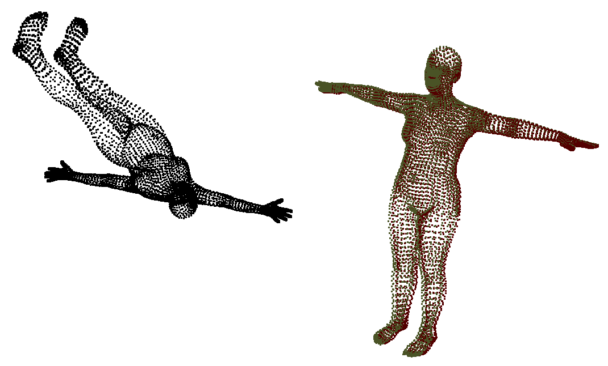

# DiffICP: Fully-Differentiable ICP in PyTorch



DiffICP is a fast, extensively tested, and fully-differentiable ICP
implemented in PyTorch.
You can use it to build end-to-end solutions for complex
graphics tasks where you want to backpropagate gradients through your ICP.

For theoretical details, check my [post][project] on how 
we used DiffICP for end-to-end 3D reconstruction.

## Requirements
* Linux or macOS
* Python 3.8.10
* (Optional) NVIDIA GPU + CUDA 10.2

### Required Packages
* torch 1.9.1
* kornia 0.5.11
* pytorch3d 0.3.0

### Optional Requirements for `test_icp.py`
* tqdm 4.62.3

### Optional Requirements for `io_utils.py`
* numpy 1.21.2
* imageio 2.9.0
* pandas 1.3.3
* opencv-python 4.5.3.56
* pyntcloud 0.1.5

## Setup
### Installation
1. Make sure you have all required packages listed above or install with `pip install -r requirements.txt`.
2. Run `pip install -e .` to install the DiffICP code.
This will allow you to import DiffICP in your own projects
with e.g. `from difficp import ICP6DoF`.

**Full Install:**
```
pip install -r requirements.txt
pip install -e .
```

## Usage
### Rigid ICP
If you want to perform rigid ICP, just import our `ICP6DoF`, initialize
an object, and run it on your point clouds or depth maps:
```python
from difficp import ICP6DoF

icp = ICP6DoF(differentiable=True, ...)
rigid_pose = icp(sources, targets, ...)
```
See arguments of `ICP.__init__()` and `ICP.__call__()` in 
`difficp/icp/icp.py` for a list of possible hyperparamters/inputs.

### Non-rigid ICP
If you need non-rigid ICP, you can build it on your own by subclassing
`difficp.icp.icp.ICP` and overwriting it's abstract methods:
```python
from difficp import ICP

class MyNonRigidICP(ICP):

    def define_num_params(self):
        return ...

    def define_transform_fn(self):
        def my_fn(points, params):
          point_cloud = ...
          return point_cloud
        return my_fn

    def define_solver(self):
        return ...
```
In `define_solver()`, you can for instance return a non-rigid LM optimizer
that you can build by subclassing `difficp.icp.optimizer.LMOptimizer`.

As an example, see `difficp.icp.icp.ICPSMPL`, which performs non-rigid
ICP based on a given [SMPL-X][smplx] model and internally uses a
non-rigid LM optimizer defined in `difficp.icp.optimizer.LMOptimizerSMPL`.

## Repository Structure
- `difficp/` is the sources root.
- `difficp/icp/` contains the differentiable ICP PyTorch implementation,
split into several modules.
  - `difficp/icp/icp.py` contains the main ICP logic
    - `difficp.icp.icp.ICP6DoF` is the most important class, which performs
rigid ICP.
    - `difficp.icp.icp.ICP` is an abstract class which `ICP6DoF` inherits from.
You can subclass it to build custom non-rigid ICPs.
  - `difficp/icp/correspondence_function.py` contains functions for
correspondence finding, weighting, and rejection.
  - `difficp/icp/distance_function.py` contains ICP distance functions
(point-to-point, point-to-plane, Symmetric ICP)
  - `difficp/icp/optimizer.py` contains a custom LM optimizer than can be
used to minimize the distance functions
  - `difficp/icp/procrustes_solver.py` contains both an analytical
procrustes solver for point-to-point, based on SVD, and a
linear solver that can be used to minimize any of the three distance
functions (or a combination of them)
  - `difficp/icp/linear_solver.py` contains a differentiable solver
for linear equations based on LU-decomposition.
This is used internally by both the LM optimizer and the linear solver.
- `difficp/tests/` contains unit tests
- `difficp/utils/` contains all kinds of util functions for:
  - 3D geometry (`geometry_utils.py`)
  - Depth map reprojection (`depthmap_utils.py`)
  - Normal calculation (`normal_utils.py`)
  - Saving/Loading point clouds, depth maps, or other data (`io_utils.py`)

Note for `difficp/utils/`: Some util functions are used by the ICP, but
most are just intended as supplementary code that you can use to
preprocess your data before you can give it to the ICP.

## Citation
If you use this code in your research, please cite it as follows:
```
@unpublished{DiffICP2021,
  title={DiffICP: Fully-Differentiable ICP in PyTorch},
  author={Altenberger, Felix and Niessner, Matthias},
  year={2021},
}
```
[project]: http://fa9r.com/projects/2021/03/30/differentiable-icp.html
[smplx]: https://github.com/vchoutas/smplx
